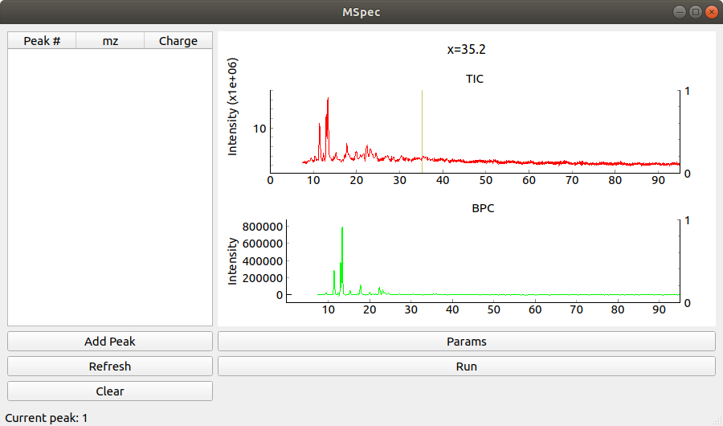
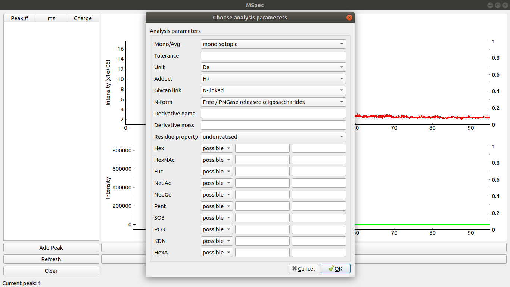
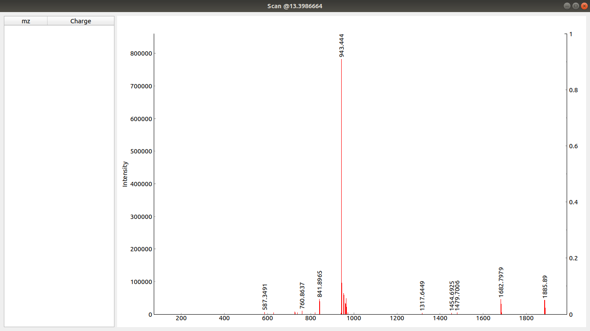
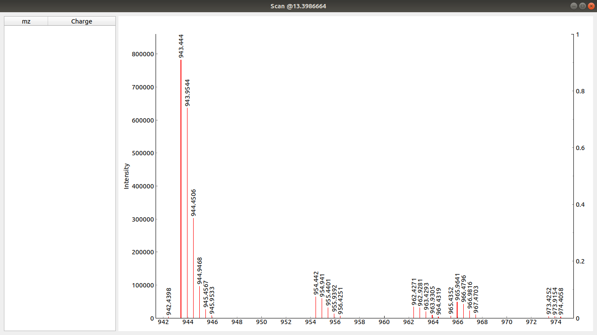
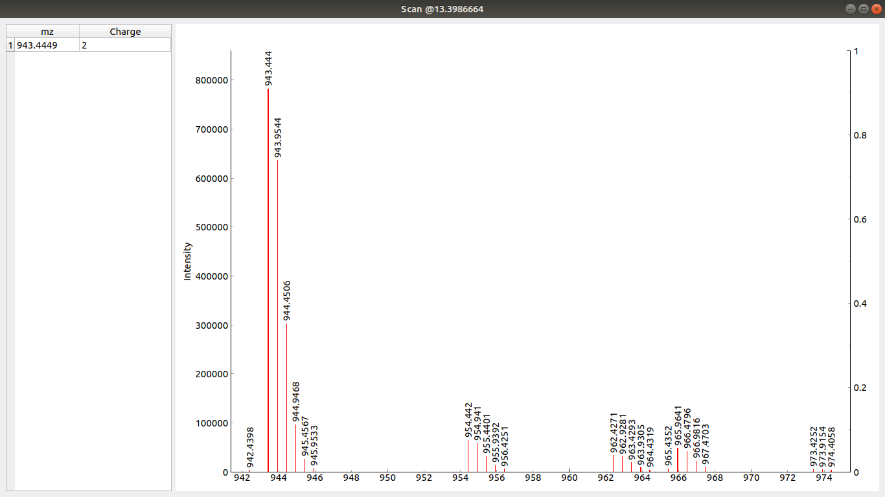
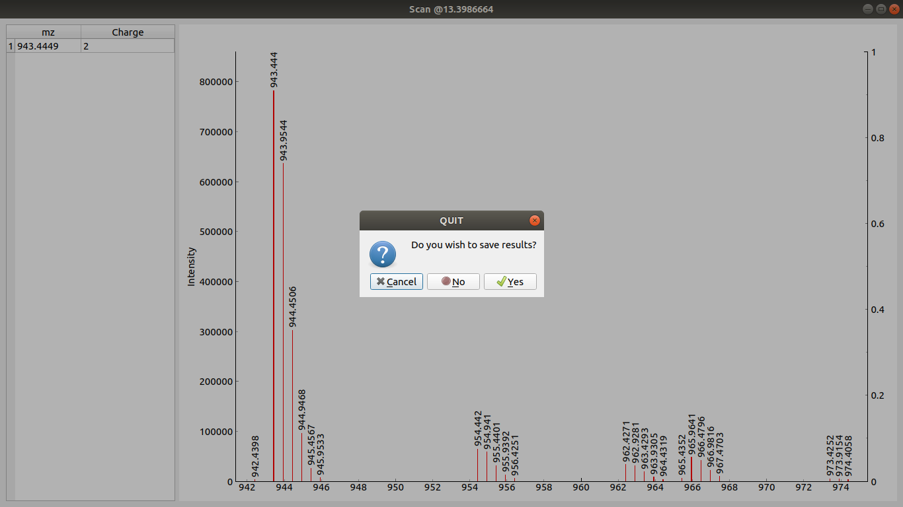
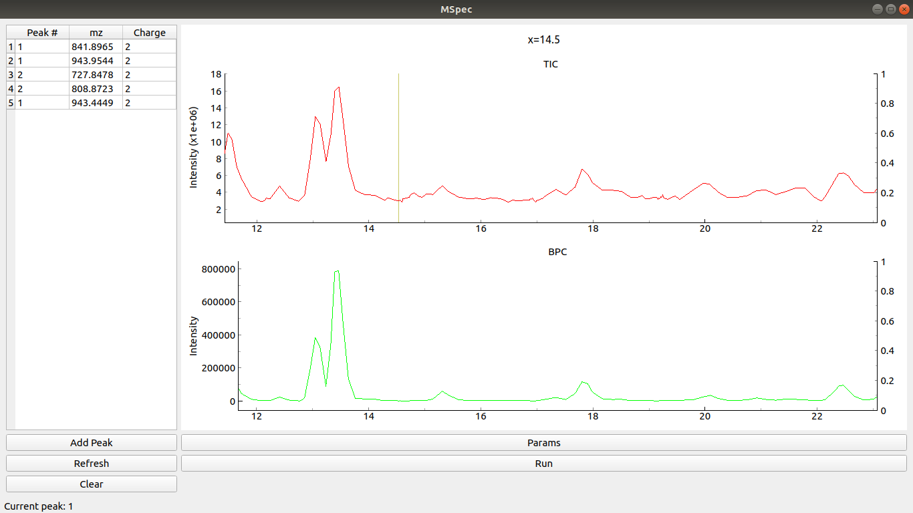

# What is MSpec?
Tool for mass spec data visualisation (under development).

### Purpose
I built this tool to help speed up my mass spec analysis and annotation workflow.
The tool can (or rather - it used to be able to) visualize data, do manual peak picking and mass searches (using Glycomod tool from ExPaSy).
The tool stores previous results for easier review.

I used it primarily for N-glycan MS analysis and it was of great use when learning about mass spectrometry and how the results were gathered, stored and the ways they could be visualised and used.

### Status
Currently it is a bit messy with lots of zombie code and bugs. The development is currently halted. Use it at your own risk.
The UI is entirely user unfriendly, but it has served its purpose.
Tests are also broken.

## UI Guide
### Main window

Clicking on any point in the top graph opens a new window with the corresponding scan loaded.
On the right there is a table showing currently picked peaks and their charges (selection done in Scan window)
Clicking Run runs the web search (currently broken)
Clicking on Params button opens analysis parameters window.


### Scan window

When you click to the left and once again to the right of the desired peak you can zoom into that part of that scan. Like this:


If you now use Ctrl+Click to click to the left and then to the right of the desired peak the peak gets selected and its charge is calculated automatically by the tool (not tested for charge states above +4 and negative states). Selected peak is shown in the table on the right of the scan window.



On scan window close a prompt is shown asking you to store or dismiss the picked peaks.


### Main Window with peaks added
If you have any picked peaks clicking Refresh loads them to the table. Clicking Clear removes them.


Clicking Add Peak changes the peak number (increases it by 1).

### Making sense of the data

Clicking Run checks online resources for matching masses and reports results.
This tool can useful for compositional analysis of glycans and proteins. 

## See it yourself:
Please use a virtual env. Install dependencies using:
```
pip install -r requirements.txt
``` 
while you are inside the MSpec folder.

Once you have the dependencies installed (PyQt5 and pyqtgraph do the heavy lifting) run:

```sh
curdir:$ python -m MSpec --file="./MSpec/example/real_data_lvl1_only.mzML" --db="./MSpec/db/testing.db" --debug

```
The file is an example of real MS data. The database is a SQlite used for testing purposes.

### Contribution
Feel free to fork and contribute.
In case of interest I am willing to divert my attention to this project again. 
